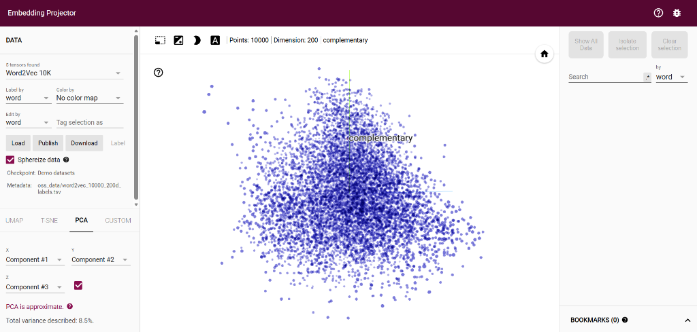

# NLP Fundamentals (NLP Cơ Bản) - Hướng Dẫn Tự Học Xử Lý Ngôn Ngữ Tự Nhiên 🚀

Chào mừng bạn đến với kho lưu trữ **NLP Fundamentals**! Đây là dự án học tập và thực hành các kiến thức cơ bản đến nâng cao về Xử lý ngôn ngữ tự nhiên (Natural Language Processing - NLP). 

Dự án này được thiết kế dưới dạng các tài liệu lập trình trực quan (Jupyter Notebooks), giúp bạn dễ dàng chạy thử nghiệm, tinh chỉnh tham số và trực quan hóa kết quả học máy.

---

## 📌 Các Nội Dung Đã Thực Hiện

### 1. [Text_preprocessing.ipynb](Text_preprocessing.ipynb) - Tiền xử lý văn bản thô
Tiền xử lý dữ liệu là bước quan trọng nhất trong mọi bài toán NLP để làm sạch dữ liệu trước khi đưa vào mô hình học máy.
* **Kiến thức cốt lõi:**
  * **Tokenization:** Tách văn bản thành các từ đơn lẻ bằng thư viện `nltk`.
  * **Stopwords Removal:** Loại bỏ các từ dừng (từ phổ biến nhưng ít mang giá trị nghĩa như *and, the, is...*).
  * **Lemmatization:** Chuẩn hóa từ về dạng gốc (ví dụ: *watching, watched* -> *watch*) bằng `WordNetLemmatizer`.
  * **Sequence Padding:** Chuyển văn bản thành chuỗi số và đệm độ dài bằng `pad_sequences` của Keras để đưa vào mạng LSTM.
  * **Model:** Xây dựng mạng nơ-ron hồi quy LSTM để phân loại cảm xúc (Sentiment Analysis) trên tập dữ liệu IMDB.

### 2. [word_embeddings.ipynb](word_embeddings.ipynb) - Vector hóa từ vựng & Word Embeddings
Hiểu cách máy tính biểu diễn từ ngữ dưới dạng các vector số trong không gian đa chiều và cách trực quan hóa chúng.
* **Kiến thức cốt lõi:**
  * **TextVectorization:** Sử dụng lớp tiền xử lý hiện đại của Keras để xây dựng bộ từ điển và vector hóa chuỗi văn bản.
  * **Embedding Layer:** Huấn luyện không gian vector biểu diễn từ (Word Embeddings) 16 chiều từ dữ liệu học máy.
  * **TensorBoard Projector:** Xuất trọng số Embedding (`checkpoint`) và file nhãn (`metadata.tsv`) để chuẩn bị trực quan hóa không gian từ vựng 3D.
  * **Trực quan hóa thực tế:** Hướng dẫn nén logs và sử dụng công cụ online để xoay, thu phóng và phân tích khoảng cách tương quan giữa các từ.

---

## 📸 Giao Diện Trực Quan Hóa (Embedding Projector)

Dưới đây là hình ảnh giao diện công cụ **TensorFlow Embedding Projector** dùng để trực quan hóa và tìm kiếm mối liên quan giữa các vector nhúng (Word Embeddings):



*Hình ảnh giao diện minh họa khi hiển thị bộ dữ liệu nhúng mẫu `Word2Vec 10K` (10,000 vector từ vựng, độ chiều 200) và từ khóa tìm kiếm được chọn là **`complementary`**.*

> [!NOTE]
> Trang web [http://projector.tensorflow.org/](http://projector.tensorflow.org/) là một công cụ trực tuyến trống dùng để hiển thị mối liên quan giữa các từ. Để xem được mô hình nhúng của riêng bạn (được huấn luyện từ file `word_embeddings.ipynb`), bạn cần chạy toàn bộ notebook để xuất ra các file dữ liệu nhúng, sau đó nhấn nút **Load** trên trang web này để tải các file `metadata.tsv` và `embedding.ckpt` lên.

---

## 🛠️ Hướng Dẫn Chạy Dự Án

### Lựa chọn 1: Chạy Online trên Google Colab (Khuyên dùng)
Bạn chỉ cần mở trực tiếp các file `.ipynb` trên trình duyệt qua Colab.
* **Cách tải file log từ Colab về máy cá nhân để xem trực quan:**
  Chạy cell cuối cùng trong file `word_embeddings.ipynb` để tự động nén thư mục `logs` thành `logs.zip` và upload lên cổng chia sẻ. Click vào link tải về, giải nén và nạp vào trang web: [http://projector.tensorflow.org/](http://projector.tensorflow.org/).

### Lựa chọn 2: Chạy Cục bộ (Local) trên VS Code
1. Cài đặt các thư viện cần thiết:
   ```bash
   pip install tensorflow tensorflow-datasets pandas scikit-learn nltk requests
   ```
2. Mở dự án bằng VS Code, chọn Kernel Python cục bộ và chạy từng cell.
3. **Để xem TensorBoard trong VS Code:**
   * Nhấn `Ctrl + Shift + P` (hoặc `Cmd + Shift + P` trên Mac).
   * Tìm kiếm và chọn lệnh: **`Python: Launch TensorBoard`**.
   * Trỏ tới thư mục `NLP-fundamentals/logs` để xem trực tiếp.
